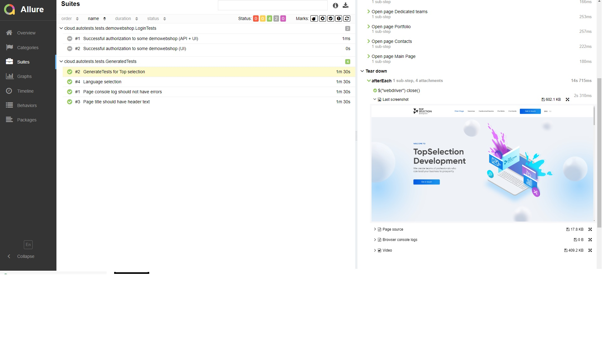
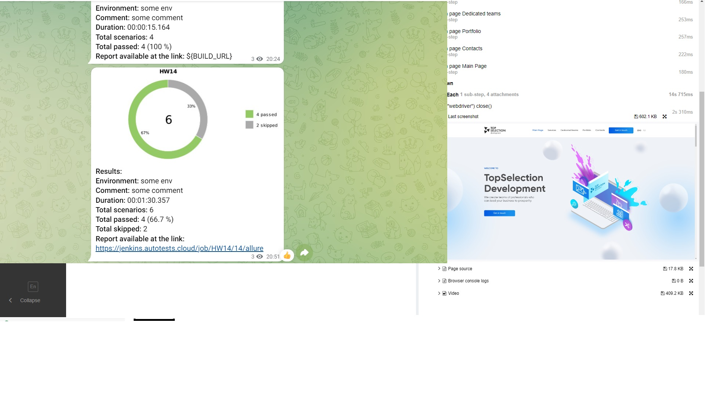

# Проект по автоматизации тестирования сайта "Top selection"

## :cherry_blossom:	Содержание


> ➠ [Стек технологий](#classical_building-стек-технологий)
>
> ➠ [Реализованные проверки](#earth_africa-реализованные-проверки)
>
> ➠ [Запуск тестов из терминала](#запуск-тестов-из-терминала)
>
> ➠ [Запуск тестов в Jenkins](#запуск-тестов-из-jenkins)
>
> ➠ [Отчет о результатах тестирования в Allure Report](#skier-главная-страница-allure-отчета)
>
> ➠ [Уведомления в Telegram с использованием бота](#-уведомления-в-telegram-с-использованием-бота)
>
> ➠ [Пример запуска теста в Selenoid](#-пример-запуска-теста-в-selenoid)


## :classical_building: Стек технологий

<p align="center">


</p>

В данном проекте автотесты написаны на <code>Java</code> с использованием <code>Selenide</code> для UI-тестов.
>
> <code>Selenoid</code> выполняет запуск браузеров в контейнерах <code>Docker</code>.
>
> <code>Allure Report</code> формирует отчет о запуске тестов.
>
> Для автоматизированной сборки проекта используется <code>Gradle</code>.
>
> В качестве библиотеки для модульного тестирования используется <code>JUnit 5</code>.
>
> <code>Jenkins</code> выполняет запуск тестов.
> После завершения прогона отправляются уведомления с помощью бота в <code>Telegram</code>.

## :earth_africa: Реализованные проверки

> Разработаны автотесты на <code>UI</code>.
### UI

- [x] Проверка заголовка главной страницы
- [x] Проверка главного меню
- [x] Проверка перехода по страница главного мею
- [x] Проверка переключения языка
- [x] Проверка отсутствия ошибок в консоли

## Запуск тестов из терминала

### :robot: Локальный запуск тестов

```
gradle clean test
```

### :robot: Удаленный запуск тестов

```
gradle clean test
-Dbrowser=${BROWSER}
-DbrowserVersion=${BROWSER_VERSION}
-DbrowserSize=${BROWSER_SIZE}
-DbrowserMobileView="${BROWSER_MOBILE}"
-DremoteDriverUrl=https://user1:1234@${REMOTE_DRIVER_URL}/wd/hub/
-DvideoStorage=https://${REMOTE_DRIVER_URL}/video/
-Dthreads=${THREADS}
```

### :robot: Параметры сборки

> <code>REMOTE_URL</code> – адрес удаленного сервера, на котором будут запускаться тесты.
>
> <code>BROWSER</code> – браузер, в котором будут выполняться тесты (_по умолчанию - <code>chrome</code>_).
>
> <code>BROWSER_VERSION</code> – версия браузера, в которой будут выполняться тесты (_по умолчанию - <code>91.0</code>_).
>
> <code>BROWSER_SIZE</code> – размер окна браузера, в котором будут выполняться тесты (_по умолчанию - <code>1920x1080</code>_).

## Запуск тестов из Jenkins

*Для запуска сборки необходимо указать значения параметров и нажать кнопку <code><strong>*Собрать*</strong></code>.*

<p align="center">
  
</p>

*Для перехода к просмотру отчета в разделе "История сборок" нажать значок "Allure Report", откроется страница с отчетом по прохождению.*

<p align="center">
  
</p>


### :skier: Allure-отчет

<p align="center">

</p>

### :eye_speech_bubble: Тест-кейсы

<p align="center">

</p>

##  Уведомления в Telegram

> После завершения сборки, Вам будет отправлено уведомление в Telegram с отчетом о прохождении.

<p align="center">

</p>

##  Пример запуска теста.

> Для каждого тест-кейса будет записано видео прохождения. Пример:
<p align="center">
  
</p>


